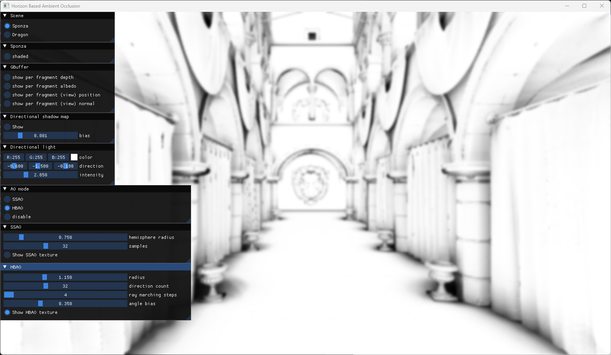

# XINF584 Project : Horizon Based Ambient Occlusion

Implementation of the paper => [https://citeseerx.ist.psu.edu/document?repid=rep1&type=pdf&doi=13bc73f19c136873cda61696aee8e90e2ce0f2d8](https://citeseerx.ist.psu.edu/document?repid=rep1&type=pdf&doi=13bc73f19c136873cda61696aee8e90e2ce0f2d8)

## Build with cmake

`
cmake -B build -S . -D CMAKE_BUILD_TYPE=Release
`

`
cmake --build build --config Release
`

## Run the program

### Windows
`
.\hbao.exe
`

### Linux
`
./hbao
`

## User interface

- Rotate view with the middle mouse button
- Zoom with scroll
- Pan view using shift + middle mouse button
